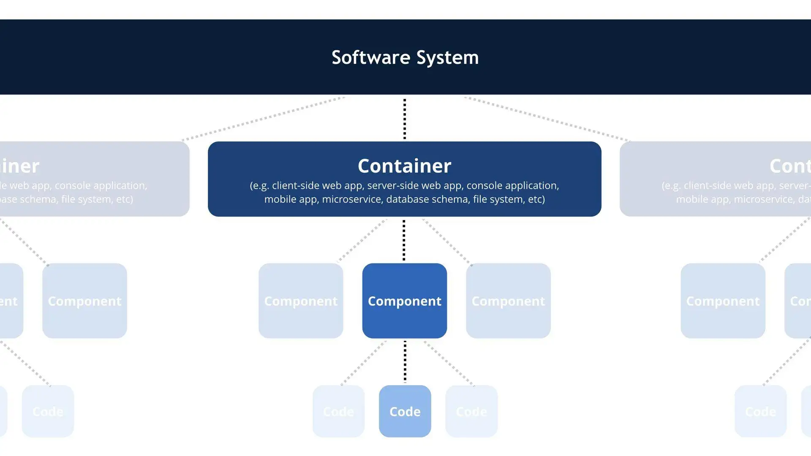

# 软件架构
本应用架构参考C4模型进行设计
## C4 模型
C4模型是一种轻量级的软件架构建模方法，用于描述软件系统的整体架构、组件和其之间的关系。C4模型的架构设计基于4个层次：

1. 上下文图（Context Diagram）：上下文图描述了整个软件系统与外部世界的交互。它展示了系统与外部用户、其他系统或外部资源之间的关系，以及数据流的方向。上下文图是架构设计的起点，用于帮助理解系统的范围和边界。
描述人与系统之间的逻辑关系
stakehoder：终端用户，产品经理

2. 容器图（Container Diagram）：容器图进一步展示了软件系统内部的主要容器和它们之间的关系。容器可以是物理或虚拟的，例如应用程序、数据库、消息代理等。容器图有助于理解系统的整体结构，并显示了容器之间的通信和依赖关系。
stakehoder：软件架构师、开发人员，支持和运维人员
要点：通讯关系（使用的协议），技术栈

3. 组件图（Component Diagram）：组件图描述了容器内部的组件和它们之间的关系。组件是系统中的可替换和可重用的模块，具有明确定义的接口和职责。组件图帮助我们了解系统内部的组件结构，以及它们如何协同工作以实现系统的功能。
stakehoder：架构师，软件开发人员
要点：组件的功能，职责及实现细节

4. 代码级图（Code-level Diagram）：代码级图展示了组件内部的详细设计和代码结构。它通常用于描述关键组件的类、接口、关系和依赖关系。代码级图有助于开发人员理解和实现具体的功能，以及组件之间的交互。
stakehoder：软件开发人员
要点：实现
成果物：类图，流程图

# 工具
## 开发工具
vscode
## 架构图设计工具
