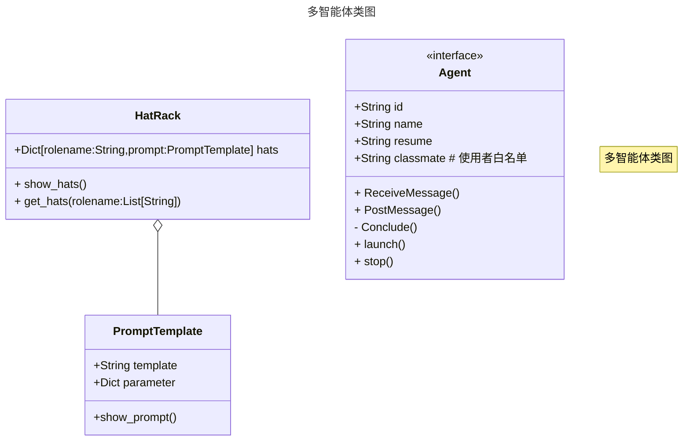

```mermaid
---
title: 多智能体类图
---
classDiagram
    note "多智能体类图"
    
    class PromptTemplate{
        +String template
        +Dict parameter

        +show_prompt()
    }

    class HatRack{
        +Dict[rolename:String,prompt:PromptTemplate] hats

        + show_hats()
        + get_hats(rolename:List[String])
    }

    HatRack o-- PromptTemplate

    class Agent{
        <<interface>>
        +String id
        +String name
        +String resume
        +String classmate # 使用者白名单

        + ReceiveMessage() 
        + PostMessage()
        - Conclude()
        + launch()
        + stop()
    }

```