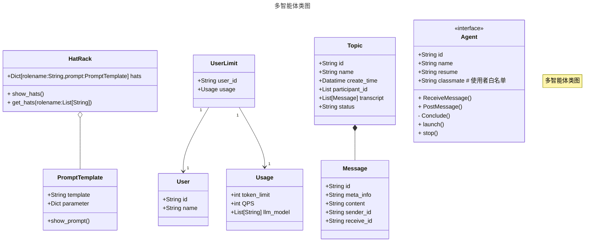
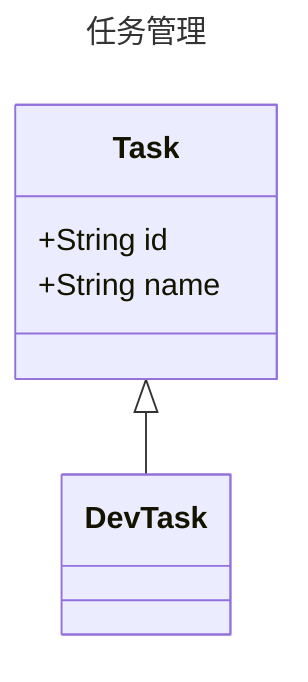

```mermaid
---
title: 多智能体类图
---
classDiagram
    note "多智能体类图"
    
    class PromptTemplate{
        +String template
        +Dict parameter

        +show_prompt()
    }

    class HatRack{
        +Dict[rolename:String,prompt:PromptTemplate] hats

        + show_hats()
        + get_hats(rolename:List[String])
    }

    HatRack o-- PromptTemplate

    class Usage{
        +int token_limit
        +int QPS
        +List[String] llm_model 
    }

    class User{
        +String id
        +String name
    }

    class UserLimit{
        +String user_id
        +Usage usage
    }
    UserLimit "1" --> "1" User
    UserLimit "1" --> "1" Usage

    class Message{
        +String id
        +String meta_info
        +String content
        +String sender_id
        +String receive_id        
    }

    class Topic{
        +String id
        +String name
        +Datatime create_time
        +List participant_id
        +List[Message] transcript
        +String status
    }

    

    Topic *-- Message

    class Agent{
        <<interface>>
        +String id
        +String name
        +String resume
        +String classmate # 使用者白名单

        + ReceiveMessage() 
        + PostMessage()
        - Conclude()
        + launch()
        + stop()
    }

```

```mermaid
---
title: 任务管理
---
classDiagram
    class Task{
            +String id
            +String name
        }
    class DevTask{
        
    }
    Task <|--DevTask

```

```mermaid
---
title: 消息管理
---


```