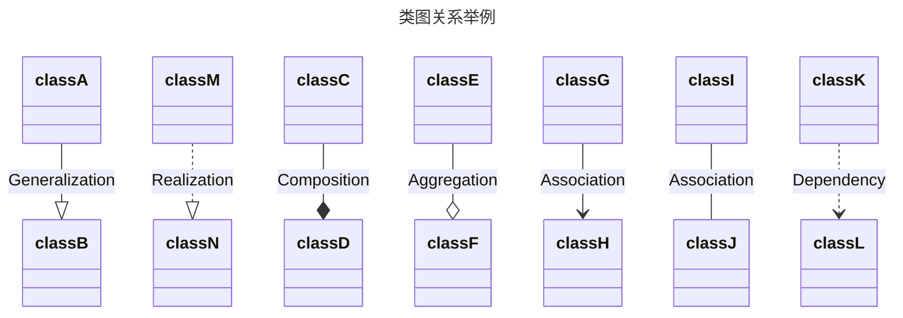

# 工具
## 动态图
线程、进程
# 静态图

# 流程
开发流程

# 参考

## mermaid类图

```mermaid
---
title: 类图关系举例
---
classDiagram
classA --|> classB : Generalization
classM ..|> classN : Realization
classC --* classD : Composition
classE --o classF : Aggregation
classG --> classH : Association
classI -- classJ : Association
classK ..> classL : Dependency

```