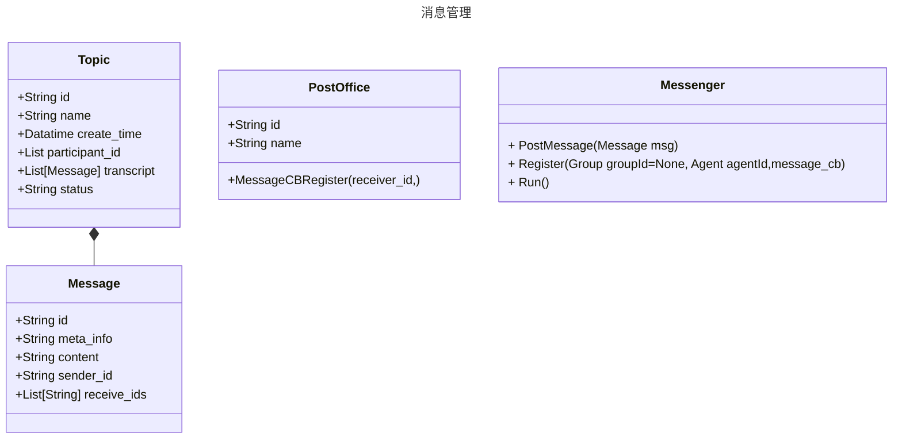

```mermaid
---
title: 消息管理

---
classDiagram

    class Message{
        +String id
        +String meta_info
        +String content
        +String sender_id
        +List[String] receive_ids
    }

    class Topic{
        +String id
        +String name
        +Datatime create_time
        %% 所有话题的参与者
        +List participant_id 
        %% 按照时序记录消息
        +List[Message] transcript
        +String status
    }

    Topic *-- Message

    class PostOffice{
        +String id
        +String name

        %% 注册一个函数用于处理接收消息
        +MessageCBRegister(receiver_id,)
    }

    %% 消息中间件，封装fastapi和kafka，为postoffic和agent提供消息服务
    class Messenger{
        + PostMessage(Message msg)
        + Register(Group groupId=None, Agent agentId,message_cb)
        + Run()
    }

```