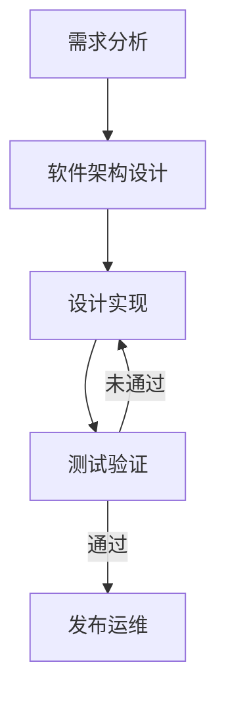
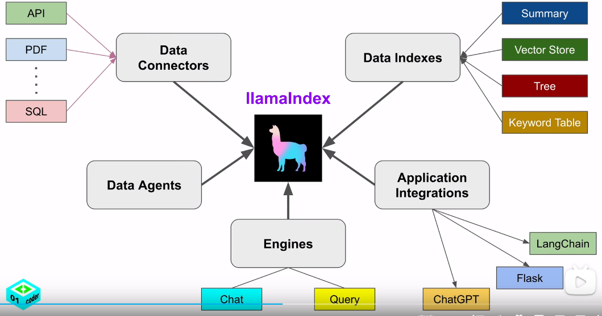

# 架构设计原则
1. 保架构图必须是自描述的，具备足够的准确性与代码保持强一致性
2. 整个架构设计应保证架构图的结构一致及语义一致
3. 建立术语表，架构图中使用的术语需要再术语表汇总有清晰明确的定义，保证需求--架构-- 代码相一致。实现语言一致，目标共识，信息透明
4. 采用C4模型 [plantuml c4](https://github.com/plantuml-stdlib/C4-PlantUML) [mermaid c4]([mermaid](https://github.com/mermaid-js/mermaid/blob/develop/README.zh-CN.md)) [c4 model](https://c4model.com/)
5. 应用gpt技术进行代码的生成
6. 架构设计可追溯可维护
7. 设计需要满足可测试性，能够实现设计，开发的高覆盖度测试及住区回放测试
8. 面向接口编程（Interface-oriented Programming，简称IoP）：通过依赖注入的方式解耦依赖项，减少通过继承方式导致的层次臃肿

# 流程
## 需求分析
## 软件架构设计
## 设计实现
## 测试验证
## 发布运维


# 架构设计
## 01 系统设计(context)
## 02 容器设计(container)
## 03 组件设计(component)
[多智能体设计](./多智能体设计.md)
### 可测试性设计：
1. 函数式设计
   1. 保证可回放验证
2. 
## 04 代码设计(code)
此部分设计应用mermaid绘制架构图，要求架构图设计严谨，可指导GPT生成对应的代码


# 开发方法学
## 源码管理
源代码使用gitlab进行管理，采用针对ai调整的aigit flow

## 架构图设计工具
mermaid：使用mermaid进行架构图设计，由于其文本型形式的特点可实现设计的可追溯性的管理
参考: [mermaid live](https://mermaid.live/)
## 基于AI的开发方法
### prompt的项目管理
需求：
    1. prompt的组织方式与生成代码的组织方式保持一致
    2. prompt与代码保持一致的可追溯性(关联一致且保存数据库方式还是git方式)
    3. prompt模版设计，便于替换
    4. prompt使用markdown语法，便于人机理解
    5. prompt明确输入和输出，便于上下游模块进行chain链接
    6. 设计包含引用、继承等方式实现prompt复用

#### pmake工具设计
自动扫描分析项目中的源码目录，根据prompt的变更生成代码，进行测试
开发工作流：
 - 用户提供需求或测试人员提供的issue问题描述和log记录，按照标准模版提交的项目中
 - 用户根据需求或issue描述通过gpt辅助编写prompt文件，当编写完成后，根据不同格式commit到开发分支中
 - 手动、自动或消息触发的方式扫描模板
 - 根据prompt的修改范围生成功能代码和测试代码
 - 将生成的代码与原有代码合并，并进行自动化测试
    * 测试通过则通过prompt生成符合标准模版的commit log(修改内容；关联issue)
    * 没有通过则根据新产生的log及对应的新开发的代码提交个开发人员(可能为虚拟)继续上面的流程
 
系统级信息通过读取专业的角色prompt完成，源码目录中主要实现软件的需求prompt

### prompt模版参考
[awesome-chatgpt-zh](https://github.com/yzfly/awesome-chatgpt-zh/tree/main)

[LangGPT](https://github.com/EmbraceAGI/LangGPT)

[wonderful-prompts](https://github.com/yzfly/wonderful-prompts)

[Prompt-Engineering-Guide](https://github.com/dair-ai/Prompt-Engineering-Guide)

## 编程语言
自然语言编程

## 编码开发
### python语言
- 编写prompt时要考虑生成代码的顺序
- 生成代码需要先进行先转换成AST然后再转回代码保证代码的一致性(要考虑到不同AST版本的兼容性关系，避免大规模的格式修改)
- 使用AST进行修改时要注意如何保留注释的代码
## 技术栈
### 前端内框架
[Flowise 拖放界面构建定制化的LLM流程](https://github.com/FlowiseAI/Flowise)

[langflow](https://github.com/logspace-ai/langflow)
### 后端内框架
Langchain：LLM的基础框架
autogen：参考设计实现
[fastapi](https://github.com/tiangolo/fastapi)

[awesome-fastapi](https://github.com/mjhea0/awesome-fastapi)

[Prompt-Engineering-Guide](https://github.com/dair-ai/Prompt-Engineering-Guide)

[jina 多模型ai应用架构](https://github.com/jina-ai/jina)

[llama_index:一个LLM数据框架，用于注入，结构化并访问私有或特定领域的数据](https://github.com/run-llama/llama_index)
    

[FastChat 训练部署框架](https://github.com/lm-sys/FastChat)
``` 
# 依赖安装
pip install optimum
pip install auto-gptq
```

[gpt-engineer用gpt来开发整个项目](https://github.com/AntonOsika/gpt-engineer)

### 产品
[privateGPT](https://github.com/imartinez/privateGPT)
1. [fern:基于openapi产生SDKs和文档](https://buildwithfern.com/)

[awesome-langchain](https://github.com/kyrolabs/awesome-langchain)

### IMS
[飞书机器人](https://github.com/whatwewant/chatgpt-for-chatbot-feishu)
[ChatGPT-Feishu](https://github.com/bestony/ChatGPT-Feishu)

## IDE

# 参考
需求：[多智能体项目需求](../01%20Project%20Requirements/project_requirements.md)
## gpt资源汇总
[免费好用的ChatGPT镜像](https://github.com/xx025/carrot)

[gpt编程助手](https://github.com/ai-boost/Awesome-GPTs#programming)

[gpt代码搜索bloop](https://github.com/BloopAI/bloop)
## 设计参考
[AutoGPT](https://github.com/Significant-Gravitas/AutoGPT)
[agent协议](https://agentprotocol.ai/)
[gpt-tool-hub](https://github.com/goldfishh/chatgpt-tool-hub)
