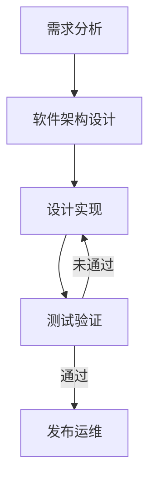

# 架构设计原则
1. 保架构图必须是自描述的，具备足够的准确性与代码保持强一致性
2. 整个架构设计应保证架构图的结构一致及语义一致
3. 建立术语表，架构图中使用的术语需要再术语表汇总有清晰明确的定义，保证需求--架构-- 代码 一致
4. 采用C4模型 [plantuml c4](https://github.com/plantuml-stdlib/C4-PlantUML) [mermaid c4]([mermaid](https://github.com/mermaid-js/mermaid/blob/develop/README.zh-CN.md)) [c4 model](https://c4model.com/)
5. 应用gpt技术进行代码的生成
6. 架构设计可追溯可维护

# 流程
## 需求分析
## 软件架构设计
## 设计实现
## 测试验证
## 发布运维

# 开发方法学
# 架构图工具
mermaid：使用mermaid进行架构图设计
参考: [mermaid live](https://mermaid.live/)
## 编程语言
自然语言编程
## 技术栈

## IDE